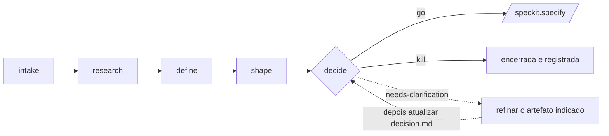

# Extensão de Avaliação de Ideias

Um fluxo de avaliação em cinco etapas que ajuda a transformar **qualquer ideia** em uma decisão fundamentada entre **go / needs-clarification / kill**, antes de iniciar o Spec-Driven Development. É a trilha de **descoberta** que antecede a trilha de **entrega** do SDD (`specify → clarify → plan → tasks → analyze → implement`).

A descoberta responde: “vale a pena construir?”. A entrega responde: “como construir?”. Somente ideias aprovadas seguem para `/speckit.specify`.

## Overview

O `assess` funciona em um projeto Spec Kit inicializado e grava as avaliações em `.specify/assessments/`. O projeto pode estar **sem código-fonte**: uma ideia em texto, URL ou ticket não exige uma base de código; uma referência ao código permite avaliar uma ideia relacionada a um repositório existente. As duas formas de começar são válidas.

Cada ideia tem seu próprio diretório em `.specify/assessments/<slug>/`, com um artefato Markdown por etapa:

```
.specify/assessments/<slug>/
├── intake.md      # speckit.assess.intake   — registrar a ideia inicial
├── research.md    # speckit.assess.research — reunir e questionar evidências
├── problem.md     # speckit.assess.define   — definir problema, objetivos e métricas
├── concept.md     # speckit.assess.shape    — estruturar opções e apetite
└── decision.md    # speckit.assess.decide   — go / needs-clarification / kill → handoff
```

O fluxo é um **funil**: muitas ideias devem ser encerradas ou adiadas antes de `shape`. Encerrar uma ideia com justificativa registrada é um resultado válido, não uma falha.



## Commands

| Comando | Etapa | Saída |
|---------|-------|--------|
| `speckit.assess.intake` | Registra e normaliza uma ideia inicial (texto, URL, ticket ou referência ao código). | `intake.md` |
| `speckit.assess.research` | Reúne evidências sobre usuários, mercado, precedentes e dados, inclusive evidências *contrárias* à ideia. | `research.md` |
| `speckit.assess.define` | Define o problema: usuários, objetivos, não objetivos, métricas de sucesso e custo de não agir. | `problem.md` |
| `speckit.assess.shape` | Compara de 2 a 3 opções conceituais, apetite e trade-offs; recomenda uma opção ou nenhuma. | `concept.md` |
| `speckit.assess.decide` | Avalia os critérios e registra a decisão; encaminha ideias `go` para `/speckit.specify`. | `decision.md` |

As etapas devem ser executadas na ordem normal, mas nem todas são obrigatórias em todos os casos:

- `define` é a etapa mínima viável e pode partir diretamente da entrada do usuário; `intake` e `research` são opcionais.
- `shape` exige `problem.md`.
- `decide` exige `problem.md`. Para resultar em `go`, também precisa de `concept.md`; sem ele, a decisão passa a `needs-clarification`.

## Esclarecer lacunas

O fluxo normal é sequencial, executando cada comando **uma vez**:

```text
intake → research → define → shape → decide
```

Cada etapa grava um artefato Markdown em `.specify/assessments/<slug>/`. Os arquivos permanecem editáveis. Os comandos não reescrevem artefatos de etapas anteriores nem fazem esse refinamento por conta própria. Marcadores `[NEEDS CLARIFICATION: …]` indicam lacunas no artefato, não um pedido para regenerar a etapa inteira.

Resolva as lacunas refinando o arquivo existente:

1. **Edite o Markdown diretamente** para preencher a métrica, responsabilidade, restrição ou informação ausente; ou
2. **Peça ao agente, em conversa livre**, que incorpore a informação ao artefato correspondente.

Depois, confirme se a nova informação resolve o bloqueio e atualize os trechos dependentes. Isso inclui `decision.md`: forneça os fatos e peça a revisão do scorecard, justificativa, decisão ou handoff. Esse processo é refinamento dos artefatos, não repetição do comando.

Ao adicionar evidências, preserve as fontes e os marcadores de confiança usados em `research` (`ASSUMPTION` versus afirmações citadas). Não invente citações.

Reexecutar uma etapa anterior de `speckit.assess.*` é uma exceção, por exemplo quando o slug estava errado ou o rascunho foi descartado; não é o caminho padrão para responder a marcadores de esclarecimento.

## Convenções de slug

O *slug* é o nome do diretório de cada ideia em `.specify/assessments/` e é compartilhado pelos cinco comandos.

- **Fornecido pelo usuário**: normalizado para minúsculas e kebab-case (por exemplo, `offline-mode`, `cut-onboarding-friction`), sem anexar datas ou números.
- **Solicitado**: no uso interativo, `speckit.assess.intake` pergunta o slug e sugere um valor em kebab-case derivado da ideia.
- **Automatizado**: quando não há uma pessoa disponível, o agente gera um slug único e não sobrescreve um diretório existente (acrescenta `-2`, `-3`, … ou uma data curta, se necessário).
- **Reutilizado do contexto**: as etapas seguintes reutilizam o slug informado anteriormente na sessão, confirmando a existência do diretório de avaliação.

## Installation

```bash
specify extension add assess
```

## Desabilitar e habilitar

```bash
specify extension disable assess
specify extension enable assess
```

## Fluxo de exemplo

```bash
# 1. Registre uma ideia (texto, URL ou referência ao repositório)
/speckit.assess.intake "Permitir que usuários trabalhem offline e sincronizem ao reconectar" slug=offline-mode

# 2. Reúna evidências favoráveis e contrárias
/speckit.assess.research slug=offline-mode

# 3. Defina o problema real
/speckit.assess.define slug=offline-mode

# 4. Estruture de 2 a 3 opções conceituais e seus apetites
/speckit.assess.shape slug=offline-mode

# 5. Decida: go, needs-clarification ou kill
/speckit.assess.decide slug=offline-mode
# Em caso de go, passe o resumo de handoff de decision.md para /speckit.specify
```

## Handoff

O `assess` é um **fluxo independente, iniciado deliberadamente**: não registra hooks de ciclo de vida nem é inserido automaticamente em `/speckit.specify`. A integração é opcional e segue em uma única direção: uma decisão `go` de `/speckit.assess.decide` fornece o resumo de `decision.md` para `/speckit.specify`. Descoberta e especificação permanecem processos separados.

## Proteções

- Somente os comandos `speckit.assess.*` gravam arquivos, e somente em `.specify/assessments/<slug>/`. **Nenhum deles altera código-fonte**; desenho detalhado e implementação pertencem ao ciclo SDD, a partir de `/speckit.specify`.
- Conteúdo obtido na Web por `intake` ou `research` é tratado como entrada não confiável e segue uma política explícita de confiança de URLs: fontes públicas permitidas são consultadas, hosts desconhecidos exigem confirmação ou são ignorados, e hosts loopback, RFC1918 e de metadados são recusados.
- Evidências não são exageradas: afirmações sem fonte recebem `ASSUMPTION`, e `research.md` sempre inclui a seção *Evidence Against the Idea*.
- Decisões não são exageradas: `go` exige problema válido, evidências com confiança `adequate` ou superior (nunca `weak` ou `unknown`) e um conceito estruturado; caso contrário, o resultado correto é `needs-clarification`.
- Slugs são normalizados para `[a-z0-9-]` e um resultado vazio é recusado. Antes de ler ou gravar, cada comando rejeita componentes de caminho que sejam links simbólicos e confirma que os caminhos resolvidos permanecem dentro do projeto.
- Nenhum comando sobrescreve um artefato existente sem confirmação; no modo automatizado, a sobrescrita é recusada.

## Relação com outras extensões

O `assess` é uma trilha de descoberta **genérica e neutra quanto ao papel**, utilizável por fundadores, PMs, analistas de negócio, engenheiros ou designers. Fluxos pré-SDD mais especializados do catálogo comunitário podem se apoiar nela ou fornecer informações a ela; o `assess` busca ser o funil mínimo e opinativo, encerrando com um handoff claro para `/speckit.specify`.
