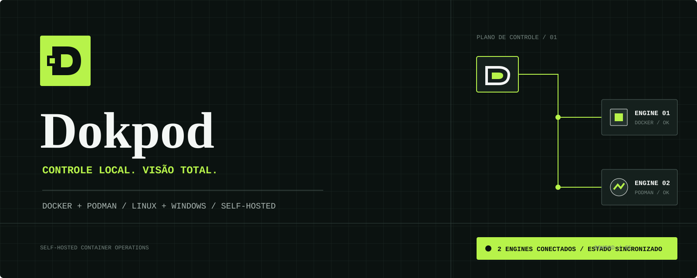
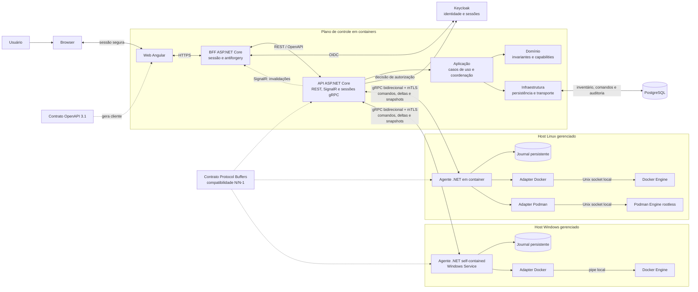

# Dokpod



Dokpod é uma plataforma web self-hosted para descobrir, observar e operar containers Docker e Podman em múltiplos servidores Linux e Windows. Em Linux, cada servidor executa o agente .NET em container. Em Windows, o agente é um Worker Service self-contained, instalado como Windows Service e sem dependência de runtime .NET no host. Em ambos os casos, o agente acessa apenas o engine local e inicia uma conexão autenticada com o plano de controle.

O produto é concorrente e funcionalmente inspirado no Portainer, com arquitetura, contratos, código e identidade próprios.

## Edições e licenciamento

A primeira entrega será o **Dokpod Community Edition**, sem chave ou limites artificiais de nodes e usuários, sob `AGPL-3.0-only`. Uma edição **Dokpod Business** poderá ser oferecida posteriormente por US$ 99/mês ou US$ 990/ano por organização, com governança, automação e suporte comercial para até 100 nodes na matriz inicialmente suportada.

Segurança essencial, autenticação, autorização básica, mTLS, correções de segurança e auditoria mínima permanecem na CE. A Business ainda não está implementada. Consulte a [licença](LICENSE), a [política de licenciamento e comercialização](docs/licenciamento.md) e o [ADR 2026-0003](docs/adr/2026-0003-licenciamento-e-edicoes.md).

## Estado

A arquitetura inicial foi aceita em 2026-09-06. Existe uma candidata de MVP
executável em laboratório com web Angular, BFF, API, PostgreSQL, Keycloak e
agente Docker Linux. Inventário, autorização por ambiente, realtime, start,
restart, stop, delete, auditoria, revogação e reconciliação foram validados ponta
a ponta com dados sintéticos.

O projeto ainda não declara compatibilidade de produção. Carga nominal/margem,
assinatura e provenance, qualificação do Windows Service em host limpo, Podman e
revisão humana final permanecem gates bloqueantes. Consulte a
[prontidão para release](docs/release-readiness.md) para o veredito atual.

## Objetivos do MVP

- cadastrar e aprovar ambientes gerenciados;
- inventariar containers e saúde do engine;
- iniciar, parar, reiniciar e excluir containers;
- suportar Docker em Linux como primeiro alvo;
- validar Podman rootless em Linux e Docker em Windows antes de declará-los estáveis;
- manter auditoria, autorização e comunicação agente-servidor seguras;
- preservar os workloads quando plano de controle ou agente estiver indisponível.

## Não objetivos iniciais

- Kubernetes, Swarm e Nomad;
- criação de containers, stacks e Compose;
- terminal interativo dentro de containers;
- gerenciamento de registries, volumes, redes ou imagens;
- plugins executáveis no servidor ou no agente;
- proxy genérico da API Docker/Podman;
- suporte nativo a Windows containers por Podman.

## Stack definida

- backend, API e agente: C# com .NET 10 LTS;
- frontend: Angular 22 com TypeScript estrito;
- identidade e autorização: Keycloak, com BFF confidencial e API como Policy Enforcement Point;
- contratos: OpenAPI 3.1 para browser/API e Protocol Buffers para agente/API;
- persistência: PostgreSQL;
- observabilidade: OpenTelemetry, logs estruturados, métricas e health checks;
- distribuição: backend, BFF e frontend sempre em containers; agente Linux em container; agente Windows como Worker Service self-contained.
- toolchains e bases OCI: imagens versionadas do projeto [`lzocateli/containers`](https://github.com/lzocateli/containers), conforme a [matriz de distribuição](docs/distribuicao.md#imagens-base-e-toolchains).

## Arquitetura resumida



O inventário persistido é uma projeção reconstruível. O engine local é a fonte de verdade do estado dos containers. O servidor envia comandos de domínio versionados; o agente não expõe um proxy irrestrito do socket.

## Estrutura do monorepo

```text
backend/
  apps/Dokpod.ControlPlane.Api/ # plano de controle HTTP, gRPC e SignalR
  apps/Dokpod.Bff/              # sessão OIDC confidencial e proteção de tokens
  apps/Dokpod.Agent/            # host comum do agente Linux/Windows
  libs/                         # domínio, aplicação, contratos e infraestrutura
  tests/
frontend/
  web/                       # aplicação Angular 22
  tests/
contracts/
  openapi/                   # API pública do plano de controle
  agent/                     # protocolo versionado agente-servidor
deploy/                      # imagens, pacote Windows, Keycloak, Compose e operação
docs/
  adr/                       # decisões arquiteturais
  plan/                      # planos legados congelados, somente histórico
specs/                       # requisitos, desenho e tarefas Spec Kit
tools/scripts/               # automação global de infraestrutura e manutenção
```

## Processo Spec Kit e fontes de verdade

O Spec Kit organiza requisitos em `specs/<feature>/spec.md`, desenho em
`plan.md` e tarefas em `tasks.md`. Os [seis conjuntos migrados](specs/README.md)
estão em **rascunho, aguardando revisão humana**; a migração documental não
autoriza implementação, testes de aplicação, CI remoto ou publicação.

O fluxo é especificar, esclarecer, planejar, gerar tarefas, analisar coerência
e implementar somente o recorte revisado e autorizado; a convergência compara
o código/evidências com esses artefatos e registra apenas trabalho residual.
Entregas já implementadas não viram novas features por haver pendência antiga
no plano. Checkboxes registram execução validada, não aprovação humana.

Este README define visão, escopo e princípios; [arquitetura](docs/arquitetura.md)
e [segurança](docs/seguranca.md) restringem as specs. ADRs em `docs/adr/` registram
decisões e não são substituídos por tarefas. A
[avaliação de release](docs/release-readiness.md) mantém o veredito **NO-GO** e
seus gates, inclusive HIGH, carga nominal e margem, N/N-1 e supply chain.

Os cinco documentos de `docs/plan/` estão congelados. Seu conteúdo, histórico,
evidências e status foram preservados, inclusive inconsistências; status antigos
não autorizam retomar planos nem aprovar/concluir os rascunhos novos. A
[matriz de rastreabilidade](specs/README.md) cobre todas as etapas e seus destinos.
Issues/Project fazem intake e acompanhamento conforme a
[gestão do projeto](docs/github-projeto-gestao.md), sem processo concorrente às specs.

## Documentação

- [Viabilidade técnica](docs/viabilidade.md)
- [Arquitetura](docs/arquitetura.md)
- [Backend e agente](docs/backend.md)
- [Backend-For-Frontend](docs/bff.md)
- [Frontend](docs/frontend.md)
- [Segurança](docs/seguranca.md)
- [Configuração do Keycloak](docs/configuracao-keycloak.md)
- [Distribuição e operação](docs/distribuicao.md)
- [Licenciamento e comercialização](docs/licenciamento.md)
- [Governança do repositório](.github/GOVERNANCE.md)
- [Política de segurança](.github/SECURITY.md)
- [Critérios de carga e desempenho](.github/PERFORMANCE_TESTING_CRITERIA.md)
- [Scripts e automação](.github/SCRIPTING.md)
- [ADR da arquitetura inicial](docs/adr/2026-0001-arquitetura-inicial.md)
- [ADR de distribuição e identidade](docs/adr/2026-0002-distribuicao-e-identidade.md)
- [ADR de licenciamento e edições](docs/adr/2026-0003-licenciamento-e-edicoes.md)
- [Conjuntos Spec Kit e rastreabilidade](specs/README.md)
- [Plano legado congelado do MVP](docs/plan/mvp.md)
- [Guia de contribuição](.github/CONTRIBUTING.md)

## Princípios

1. O plano de controle nunca acessa diretamente o socket de um host remoto.
2. A comunicação do agente parte do host gerenciado e usa identidade por ambiente.
3. Keycloak é a autoridade externa de identidade e autorização; o Dokpod não mantém senhas nem políticas próprias.
4. Operações mutáveis são autorizadas, auditáveis, deduplicadas e reconciliáveis.
5. Docker e Podman são capacidades distintas sob um contrato comum, não engines presumidos como idênticos.
6. Secrets, conteúdo de logs de containers e credenciais nunca entram em telemetria por padrão.
7. Dependências externas exigem licença permissiva, manutenção ativa e versão fixada.

## Próxima etapa

Revisar humanamente os [seis rascunhos](specs/README.md), resolver divergências
de evidência/status e autorizar tarefas específicas antes de qualquer execução.
Depois dessa autorização, avaliar a diferença frente ao comportamento já
implementado, validar e concluir apenas o residual correspondente.

A qualificação [Docker Linux](specs/005-qualificacao-release-docker-linux/spec.md)
preserva CI remoto, triagem HIGH, carga nominal 56/1.120/30 por pelo menos
30 minutos, margem >=100/2.000/50, N/N-1, assinatura/provenance, recuperação e
decisão humana GO/NO-GO. [Windows e Podman](specs/006-qualificacao-windows-podman/spec.md)
exigem qualificação própria ou adiamento humano formal na matriz inicial.
Sem essas decisões, permanece NO-GO; suporte publicado, assinatura, publicação
e deploy exigem suas autorizações específicas e não decorrem desta migração.
