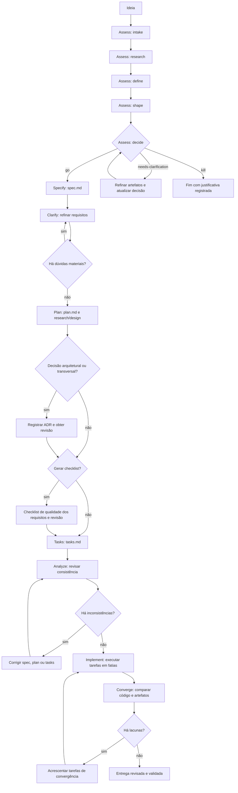

# Guia de uso do Spec Kit

Este guia apresenta o fluxo de Spec-Driven Development (SDD) recomendado para os desenvolvedores do Inventory360Api, incluindo os comandos centrais do Spec Kit e os processos oficiais opcionais.

## Antes de começar

Os comandos `/speckit-*` são executados no chat do agente de código, como GitHub Copilot. Eles não são comandos de terminal. Este guia usa a forma padrão do Copilot em modo skills. Em outras integrações ou no modo commands, a grafia pode ser diferente; por exemplo, `/speckit-specify` pode aparecer como `/speckit.specify`. Use a forma registrada pelo agente ativo.

Em um projeto já inicializado, os artefatos de feature normalmente ficam em `specs/`. Consulte `specify extension list` para ver quais extensões estão instaladas. As extensões opcionais podem ser instaladas na raiz do projeto com `specify extension add <nome>`.

No Inventory360Api:

- A constituição em `.specify/memory/constitution.md` registra princípios duradouros do projeto. Revise-a; não crie outra constituição por feature.
- A spec define requisitos e comportamento esperado. Não use este guia ou outro documento de processo como fonte concorrente de requisitos.
- O plano técnico e as tarefas devem respeitar a arquitetura, as instruções do repositório, as dependências fixadas e as aprovações necessárias.
- Registre em `research.md` incertezas e evidências; não apresente suposições como fatos confirmados.

## Fluxo recomendado para uma feature

O fluxo abaixo é o caminho padrão. Constituição é mantida uma vez por projeto; `clarify`, `checklist` e `analyze` são etapas de qualidade opcionais, mas recomendadas quando houver ambiguidade ou risco relevante.

```text
Revisar constituição
  -> specify
  -> [clarify, repetir se necessário]
  -> plan
  -> [checklist e revisão humana]
  -> tasks
  -> [analyze; corrigir artefatos e analisar novamente se necessário]
  -> implement
  -> converge
  -> [implement + converge até não restarem lacunas]
  -> [taskstoissues, se for necessário acompanhar no GitHub]
```

Somente `/speckit-specify` é requisito estrito antes de `/speckit-plan`. A avaliação de ideia com `assess` é opcional e acontece antes do fluxo de entrega: use-a quando ainda for preciso decidir se vale a pena construir a proposta. Para uma feature pequena, o desenvolvedor pode simplificar as verificações opcionais; não pule a revisão dos artefatos nem a validação da implementação. Para uma mudança que não seja uma feature, veja também o fluxo de bug adiante.

### Comandos centrais

| Comando no Copilot | Quando usar | Exemplo |
| --- | --- | --- |
| `/speckit-constitution` | Na configuração inicial do projeto ou quando os princípios duradouros precisarem mudar. Mudanças na constituição exigem revisão humana. | `/speckit-constitution Revise os princípios do projeto para refletir os padrões aprovados de segurança, testes e arquitetura. Preserve as regras existentes que continuem válidas.` |
| `/speckit-specify` | Para criar ou atualizar requisitos de uma feature. Descreva o problema e o resultado esperado, sem escolher a implementação técnica. | `/speckit-specify No Inventory360Api, permita consultar inventários por período de criação, com paginação. Defina comportamento, validações, autorização e cenários de erro; não escolha a solução técnica.` |
| `/speckit-clarify` | Antes do plano, quando a spec tiver lacunas ou interpretações concorrentes. Responda às perguntas e peça foco em uma área específica. | `/speckit-clarify Foque nos limites de período, valores ausentes, paginação e comportamento para datas inválidas.` |
| `/speckit-plan` | Depois de esclarecer os requisitos. Informe restrições técnicas e peça análise do código, testes e configuração existentes. | `/speckit-plan Use a arquitetura atual do Inventory360Api em .NET 8. Reutilize padrões existentes, não adicione dependências sem aprovação e identifique os projetos e testes afetados.` |
| `/speckit-checklist` | Para criar uma lista revisável de qualidade dos requisitos antes de decompor ou implementar o trabalho. | `/speckit-checklist Foque na autorização, limites do período, paginação e respostas para entradas inválidas.` |
| `/speckit-tasks` | Depois da spec e do plano, para gerar tarefas ordenadas e executáveis. | `/speckit-tasks` |
| `/speckit-analyze` | Depois das tarefas e antes da implementação, para encontrar contradições, lacunas e tarefas sem requisito correspondente. | `/speckit-analyze` |
| `/speckit-implement` | Depois de revisar e aprovar os artefatos. Pode ser limitado a uma fase ou história; valide cada etapa antes de continuar. | `/speckit-implement Implemente somente a fase inicial e pare antes das histórias de usuário. Rode as verificações focadas da etapa.` |
| `/speckit-converge` | Depois de implementar as tarefas atuais, para comparar o código com a spec, o plano e as tarefas. | `/speckit-converge` |
| `/speckit-taskstoissues` | Opcionalmente, depois de gerar tarefas, quando for útil acompanhá-las como issues do GitHub. Requer remote GitHub e ferramentas GitHub MCP disponíveis ao agente. | `/speckit-taskstoissues` |

### Como revisar e repetir o fluxo

1. Revise a spec após `specify` e `clarify`. Se ainda houver requisito indefinido, esclareça-o antes do plano.
2. Revise o plano, incluindo camadas afetadas, decisões abertas, impacto em contratos/dados e estratégia de validação.
3. Revise a checklist gerada por `checklist`. Ela avalia a qualidade dos requisitos, não a conclusão do código. Os itens de checklists customizadas devem ser aprovados pelo revisor responsável.
4. Execute `analyze` após `tasks`. Corrija o artefato que originou cada problema (spec/clarify para requisito, plan para desenho, tasks para decomposição) e rode `analyze` novamente.
5. Execute `implement` em fatias que possam ser verificadas. Se houver itens de checklist sem aprovação, o comando pode pedir confirmação; ele não deve marcar a checklist por conta própria.
6. Execute `converge`. Se acrescentar tarefas, implemente-as e rode `converge` novamente até o resultado ser `Converged`.
7. Revise código e testes normalmente. `Converged` verifica aderência aos artefatos, mas não substitui revisão humana, testes, build ou gates do repositório.

## Fluxo opcional para corrigir um bug

O processo `bug` é independente do ciclo de feature e precisa da extensão instalada. Não é necessário criar spec, plano e tarefas antes da triagem.

```text
/speckit-bug-assess -> /speckit-bug-fix -> /speckit-bug-test
```

| Comando | Uso e exemplo |
| --- | --- |
| `/speckit-bug-assess` | Analisa um relato ou URL, avalia se há um bug e propõe uma correção. É somente leitura em relação ao código-fonte. Exemplo: `/speckit-bug-assess "A consulta paginada falha quando o filtro de data final não é enviado." slug=inventory-date-filter` |
| `/speckit-bug-fix` | Aplica a correção registrada na avaliação e documenta mudanças e desvios. Exemplo: `/speckit-bug-fix slug=inventory-date-filter` |
| `/speckit-bug-test` | Executa a reprodução e as verificações descritas, registrando o resultado como `verified`, `partial` ou `failed`. Exemplo: `/speckit-bug-test slug=inventory-date-filter` |

Instalação: `specify extension add bug`. As avaliações e relatórios ficam em `.specify/bugs/<slug>/`. Uma verificação não executada não pode ser reportada como `verified`.

## Quando ainda existe apenas uma ideia

Não é necessário chegar com requisitos fechados. A extensão `assess` está instalada neste repositório e adiciona um fluxo de descoberta antes do fluxo de entrega do Spec Kit. Use-a para reunir evidências e decidir se a ideia deve avançar, ser esclarecida ou ser encerrada. Ela não é pré-requisito de `/speckit-specify` e não altera código-fonte.

Para o exemplo de aprovação automática de Pull Requests, o percurso completo é:



Os cinco comandos de assessment recebem o mesmo `slug` e registram os artefatos em `.specify/assessments/<slug>/`. A sequência normal é executá-los uma vez, na ordem mostrada. Se aparecer uma lacuna, refine o artefato existente e atualize os documentos posteriores afetados; não reexecute etapas como substituto para esclarecer os dados. `shape` depende de `problem.md`; `decide` precisa de `problem.md` e só pode concluir `go` com evidências adequadas e um conceito recomendado. Se a decisão for `kill`, encerre com a justificativa registrada. Se for `needs-clarification`, refine o artefato indicado, atualize a justificativa/decisão e revise os artefatos dependentes antes de concluir; repetir o comando é exceção, não o fluxo normal.

### 1. Capture a ideia sem julgá-la

`intake` registra a proposta e sua origem, sem avaliar viabilidade nem propor solução. Informe também as dúvidas já conhecidas:

```text
/speckit-assess-intake "Avaliar se Pull Requests de baixo risco poderiam ser aprovados automaticamente.
O problema percebido é o tempo de espera por revisão. Foram mencionados como possíveis critérios
resultados do SonarQube, vulnerabilidades, versão LTS do framework e licenciamento das dependências.
Ainda não sabemos quem poderia habilitar a política, se a aprovação humana seria opcional ou obrigatória,
nem quais evidências de auditoria seriam necessárias." slug=auto-pr-approval
```

O exemplo é didático e não define requisitos do Inventory360Api. O `slug` identifica os arquivos desta avaliação; use-o nos comandos seguintes.

### 2. Reúna evidências a favor e contra

`research` deve testar a hipótese, não apenas confirmá-la. Peça evidências rastreáveis e registre afirmações sem fonte como hipóteses:

```text
/speckit-assess-research slug=auto-pr-approval
Busque evidências sobre o tempo gasto em revisão, a proporção de PRs realmente elegíveis,
o efeito de automações semelhantes e os riscos de aprovar mudanças inseguras. Inclua evidências
contrárias à ideia, fontes e nível de confiança. Não apresente suposições como fatos.
```

Não inclua dados internos ou métricas inventadas. Se não houver fonte acessível, registre a lacuna como desconhecida; evidência fraca ou ausente não justifica uma decisão `go`.

### 3. Defina o problema e como medir valor

`define` consolida quem é afetado, o problema, objetivos, itens fora de escopo, métricas de sucesso e custo de não agir. Pode ser executado mesmo sem `intake` ou `research`, mas neste exemplo já usamos ambas as etapas:

```text
/speckit-assess-define slug=auto-pr-approval
Defina os usuários afetados, o problema confirmado pelas evidências, os objetivos e não objetivos,
o custo de não agir e métricas de sucesso que possam ser medidas. Separe fatos, hipóteses e dados
que ainda precisam ser obtidos. Não invente metas numéricas.
```

Metas como “reduzir o tempo de aprovação em 50%”, “reter auditoria por sete anos” ou “disponibilidade de 99,9%” são apenas exemplos. Só devem virar compromisso quando houver fonte, responsável, método de medição e viabilidade confirmados.

### 4. Compare opções sem desenhar a implementação

`shape` permanece no nível conceitual: compara opções, escopo, esforço relativo e trade-offs; não define arquitetura, APIs, modelo de dados ou tarefas de engenharia.

```text
/speckit-assess-shape slug=auto-pr-approval
Compare opções conceituais, por exemplo: manter o processo atual com recomendações automatizadas;
permitir aprovação automática apenas para critérios estritos; ou exigir confirmação humana após as
verificações. Para cada opção, descreva benefícios, riscos, limites e esforço relativo. Não escolha
arquitetura nem detalhe a implementação.
```

### 5. Registre a decisão e faça o handoff

`decide` avalia validade do problema, força das evidências, valor, viabilidade e riscos. O resultado pode ser `go`, `needs-clarification` ou `kill`:

```text
/speckit-assess-decide slug=auto-pr-approval
```

Uma decisão `go` produz um resumo de handoff em `.specify/assessments/auto-pr-approval/decision.md`. Revise-o e passe o conteúdo relevante a `/speckit-specify`; o comando de assessment não cria a spec automaticamente:

```text
/speckit-specify Com base no seguinte handoff aprovado, escreva os requisitos funcionais,
as regras de negócio, restrições, cenários de falha e critérios de aceitação. Preserve as dúvidas
como pontos a esclarecer; não transforme hipóteses em requisitos e não escolha a arquitetura técnica.

<cole aqui o resumo "If go — Handoff to /speckit-specify" de decision.md>
```

### Pós-ideia: da decisão `go` à entrega

Os exemplos abaixo continuam a mesma feature `auto-pr-approval`, agora após o handoff de `decision.md`. Eles mostram como transformar a ideia aprovada em requisitos, desenho técnico e trabalho implementável. A decisão `go` não aprova automaticamente requisitos, arquitetura ou mudanças de código: revise cada artefato antes de avançar.

#### 6. Esclareça a especificação

Leia o `spec.md` criado por `/speckit-specify`. Se ainda houver dúvidas que alterem escopo, autorização ou comportamento, use `/speckit-clarify` antes do plano. O comando apresenta uma pergunta por vez e faz no máximo cinco perguntas relevantes durante a sessão; responda com decisões confirmadas, sem pedir que o agente invente políticas:

```text
/speckit-clarify Para a feature auto-pr-approval, esclareça somente decisões ainda abertas que
alterem os requisitos ou critérios de aceitação. Priorize quem pode habilitar a política, como
tratar verificações indisponíveis, se há confirmação humana e quais evidências devem ser auditáveis.
Não repita decisões já presentes na spec nem escolha detalhes de implementação.
```

Se não restarem dúvidas materiais, revise a spec e siga em frente. Não use `clarify` para decidir stack, arquitetura ou decomposição técnica; essas decisões pertencem ao plano.

#### 7. Crie o plano técnico

Com os requisitos estáveis, use `/speckit-plan` para investigar o código, testes e configuração atuais do Inventory360Api e propor o desenho da implementação. O plano pode gerar `research.md`, `data-model.md`, `contracts/` e `quickstart.md`, conforme aplicável. Revise decisões, camadas afetadas, dependências e verificações da constituição:

```text
/speckit-plan Para auto-pr-approval, examine a arquitetura e os padrões existentes no Inventory360Api.
Mapeie os projetos, contratos e testes afetados. Separe fatos encontrados no código de decisões
propostas, registre alternativas e riscos, respeite a constituição e não adicione dependências sem
aprovação. Não assuma integrações ou capacidades que não estejam comprovadas no repositório.
```

O plano detalha como implementar; ele não deve redefinir os requisitos da spec. Resolva os itens `NEEDS CLARIFICATION` e revise o desenho antes de gerar tarefas.

#### Decisões arquiteturais e ADR

O plano pode revelar uma decisão arquitetural ou transversal que precise ser durável, como uma escolha com impacto em contratos, segurança, dados ou integração. Nesse caso, registre a decisão no fluxo de ADR do projeto e obtenha a revisão humana necessária antes de decompor o trabalho em tarefas. Se o plano não identificar uma decisão desse tipo, não crie um ADR apenas para cumprir uma etapa do fluxo.

Spec e ADR têm papéis diferentes: a spec é a fonte de requisitos e comportamento esperado; o ADR registra a decisão, alternativas, consequências e justificativa. O ADR não substitui a spec nem deve duplicar seus requisitos. Siga a [política de decisões arquiteturais](../instructions/architecture-decisions.instructions.md) para avaliar quando um ADR é necessário.

#### 8. Verifique a qualidade dos requisitos

Depois de revisar o plano e antes de decompor o trabalho, gere uma checklist focada na clareza, completude e testabilidade dos requisitos. A checklist não testa o código nem substitui os critérios de aceitação:

```text
/speckit-checklist Para auto-pr-approval, avalie se os requisitos definem com clareza autorização,
critérios de elegibilidade, comportamento quando uma verificação falha ou fica indisponível,
confirmação humana, auditoria, rollback e critérios de aceitação verificáveis. Verifique requisitos,
não se a implementação funciona.
```

O comando gera itens desmarcados; o revisor responsável avalia cada um e marca `[x]` somente quando o requisito satisfaz aquele critério de qualidade. `[x]` não significa que a funcionalidade foi implementada. Revise a checklist antes de continuar: `/speckit-implement` examina todas as checklists e pode parar se houver itens desmarcados.

#### 9. Gere tarefas executáveis

Use `/speckit-tasks` depois de aprovar a spec e o plano. Confira se as tarefas cobrem cada história e contrato, estão ordenadas por dependência, apontam caminhos claros e têm critérios para testar cada fatia independentemente:

```text
/speckit-tasks Para auto-pr-approval, gere tarefas incrementais e ordenadas por dependência,
relacionadas às histórias e aos requisitos da spec. Inclua testes e caminhos de arquivos claros,
priorize um MVP verificável e mantenha cada história testável de forma independente.
```

#### 10. Analise a consistência antes de implementar

Execute `/speckit-analyze` após a geração de `tasks.md`. A análise compara spec, plano, tarefas e constituição; é somente leitura e não corrige os artefatos:

```text
/speckit-analyze
```

Se houver achados, corrija o artefato que os originou: requisitos na spec, desenho no plano ou decomposição nas tarefas. Depois execute a análise novamente. Só implemente quando as inconsistências relevantes estiverem resolvidas e os documentos revisados.

#### 11. Implemente em fatias revisáveis

Execute `/speckit-implement` com o `tasks.md` aprovado. Para reduzir o tamanho de cada revisão, limite a execução a uma fase ou história e peça validação focada antes de seguir:

```text
/speckit-implement Implemente somente a fundação e a primeira história de auto-pr-approval.
Siga spec.md, plan.md e tasks.md; execute os testes relevantes e pare ao concluir essa fatia.
Não avance para as próximas histórias sem revisão.
```

Se o comando encontrar checklists com itens desmarcados, revise-os; não os marque como concluídos por causa da implementação. Se optar por prosseguir apesar de itens pendentes, deixe explícita a decisão e o risco.

#### 12. Converja código e artefatos

Depois de implementar as tarefas planejadas, execute `/speckit-converge` para comparar o código atual com spec, plano, tarefas e constituição:

```text
/speckit-converge
```

Se não houver lacunas, o resultado será convergido e `tasks.md` permanecerá inalterado. Se houver trabalho faltante, o comando acrescentará tarefas rastreáveis ao final de `tasks.md`; implemente essas tarefas com `/speckit-implement` e execute `/speckit-converge` novamente. Repita até não restarem lacunas. Convergência não substitui revisão humana, testes, build ou gates do repositório.

## Extensões oficiais auxiliares

Estas extensões não são pré-requisitos do SDD. Instale somente quando o fluxo da equipe precisar delas.

### Git

Instalação: `specify extension add git`.

| Comando no Copilot | Uso |
| --- | --- |
| `/speckit-git-initialize` | Inicializar o repositório Git. |
| `/speckit-git-feature` | Criar uma branch de feature com a convenção configurada. |
| `/speckit-git-validate` | Validar a convenção da branch atual. |
| `/speckit-git-remote` | Detectar informações do remote Git. |
| `/speckit-git-commit` | Fazer commit conforme a configuração da extensão. |

A extensão também pode associar algumas operações a hooks antes ou depois de comandos centrais. Confira `.specify/extensions/git/git-config.yml`; não presuma que auto-commit esteja habilitado. Git e criação de branches são opcionais para gerar artefatos de spec.

### GitHub Issues

A instalação da extensão `github` registra `/speckit-github-taskstoissues`, que publica tarefas como issues no repositório indicado pelo remote. Use `specify extension add github` para instalá-la. O fluxo requer remote GitHub e acesso às ferramentas GitHub MCP do agente.

`/speckit-taskstoissues` continua disponível no núcleo. A documentação prevê migrar essa função para a extensão namespaced; enquanto ambos coexistirem, escolha apenas um para evitar duplicar o mesmo trabalho.

### Contexto do agente

Instalação: `specify extension add agent-context`.

- `/speckit-agent-context-update`: atualiza a seção gerenciada no arquivo de contexto do agente ativo, conforme a configuração da extensão.

O Spec Kit não modifica esse arquivo quando a extensão não está instalada. Revise o diff depois da atualização para preservar instruções escritas manualmente fora da seção gerenciada.

## Como descobrir comandos instalados

Use estes comandos no terminal, na raiz de um projeto Spec Kit:

```powershell
specify extension list
specify extension search
specify extension info <nome>
```

Para habilitar uma extensão já instalada, use `specify extension enable <nome>`; para desabilitá-la, `specify extension disable <nome>`. Consulte a documentação da extensão para requisitos, comandos e efeitos antes de usá-la.

O catálogo comunitário contém extensões mantidas por terceiros, que podem acrescentar outros comandos. A listagem do catálogo não representa auditoria ou endosso. Revise o código, origem e permissões antes de instalar. Extensões, presets e workflows também podem personalizar os comandos; portanto, a lista deste guia cobre os comandos do núcleo e as extensões oficiais documentadas, não todos os comandos possíveis de terceiros.

## Referências oficiais

- [Agentic SDD e comandos centrais](https://github.github.io/spec-kit/reference/agentic-sdd.html)
- [Bug fixing](https://github.github.io/spec-kit/reference/agentic-bugfix.html)
- [Idea assessment](https://github.github.io/spec-kit/reference/agentic-assessment.html)
- [Comandos do CLI](https://github.github.io/spec-kit/reference/core.html)
- [Integrações e formas de invocação](https://github.github.io/spec-kit/reference/integrations.html)
- [Extensões](https://github.github.io/spec-kit/reference/extensions.html)
- [Personalização](https://github.github.io/spec-kit/guides/customization.html)
- [Extensões comunitárias](https://github.github.io/spec-kit/community/extensions.html)
- [Extensão Git](https://github.com/github/spec-kit/blob/main/extensions/git/README.md)
- [Extensão GitHub](https://github.com/github/spec-kit/blob/main/extensions/github/README.md)
- [Extensão agent-context](https://github.com/github/spec-kit/blob/main/extensions/agent-context/README.md)
